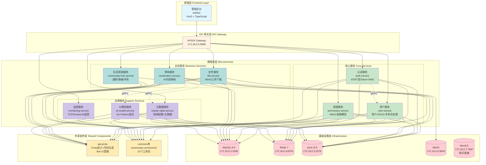
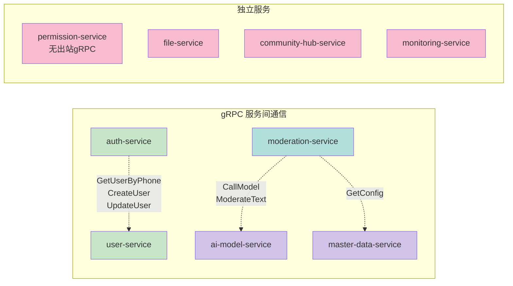
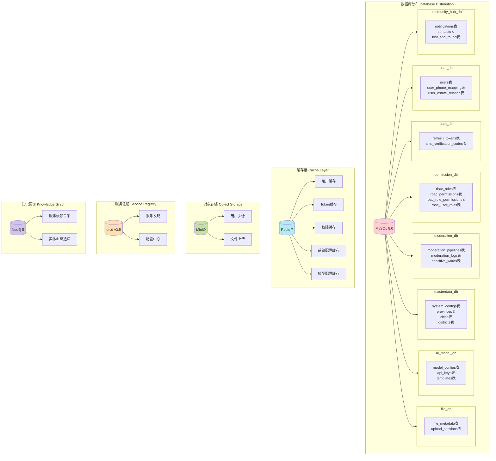
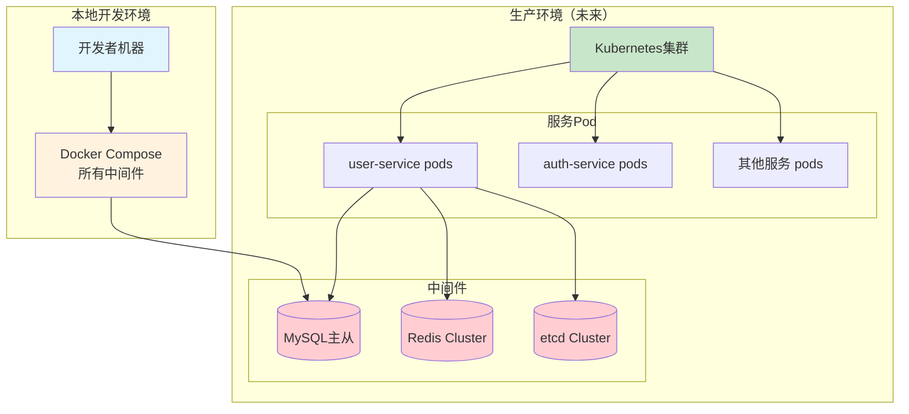

# Community-and-Home 项目架构图

## 整体架构

## 服务间通信架构

## 数据存储架构

## 服务详细信息

| 服务 | 端口 | 职责 | 依赖服务 | 数据库 |
|------|------|------|---------|--------|
| **user-service** | RPC:8081, API:8001 | 用户CRUD、手机号加密、小区归属 | - | user_db |
| **auth-service** | RPC:8082 | AT/RT双Token、SMS验证码、RSA加密 | user-service | auth_db |
| **permission-service** | RPC:8083 | RBAC权限模型、角色权限管理 | - | permission_db |
| **master-data-service** | RPC:8085, API:8005 | 系统配置、主数据管理、Outbox模式 | - | masterdata_db |
| **moderation-service** | RPC:8086, API:8006 | AI内容审核、Pipeline引擎 | ai-model-service, master-data-service | moderation_db |
| **ai-model-service** | RPC:8084, API:8004 | Go+Python混合、模型管理、API密钥 | - | ai_model_db |
| **file-service** | RPC:8087, API:8007 | MinIO上传下载、文件元数据 | - | file_db |
| **community-hub-service** | RPC:8088, API:8008 | 通知、联络、寻失 | - | community_hub_db |
| **monitoring-service** | API:8009 | TCP/Docker/AI三层监控 | - | - |

## 技术栈

### 后端
- **语言**: Go 1.23.4
- **框架**: go-zero (REST + gRPC)
- **ORM**: GORM
- **Proto管理**: Buf v2
- **服务注册**: etcd v3.5

### 前端
- **框架**: Vue 3 + TypeScript
- **构建**: Vite
- **路由**: Vue Router
- **状态管理**: Pinia

### 基础设施
- **数据库**: MySQL 8.0
- **缓存**: Redis 7
- **对象存储**: MinIO
- **API网关**: Apache APISIX
- **知识图谱**: Neo4j 5
- **容器编排**: Docker Compose

### 开发工具
- **代码生成**: goctl (go-zero官方工具)
- **Proto生成**: protoc + buf
- **工作区**: Go Workspace (go.work)
- **AI辅助**: Claude Code + Harness 架构

## 错误码规范

格式：5位 `XXYYY`
- `XX` = 服务中心
  - 99: Common
  - 10: User
  - 50: Auth
  - 06: Permission
  - 07: File
  - 30: AI Model
  - 40: Moderation
- `YYY` = 具体错误（001-999）
- `0` = 成功

示例：
- `10001`: 用户服务错误
- `50400`: 认证失败
- `06403`: 权限不足
- `30500`: AI模型服务内部错误

## 部署架构

---

**生成时间**: 2026-06-21  
**维护者**: Global Architecture Coordinator (Kiro)  
**数据来源**: `.harness/rules/工程结构.md`, `.harness/knowledge/INDEX.md`, 各服务 `docs/design.md`
